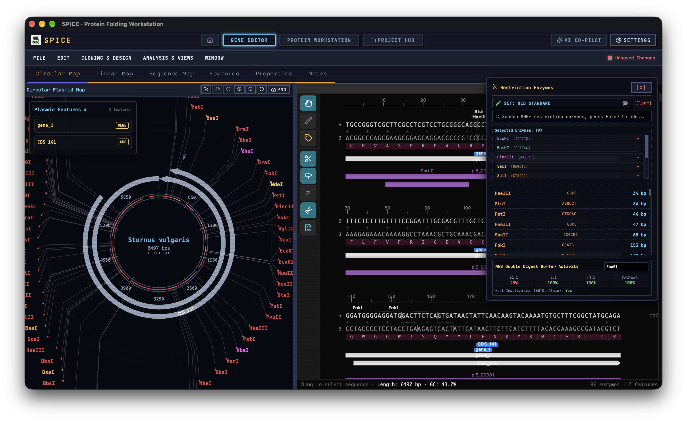
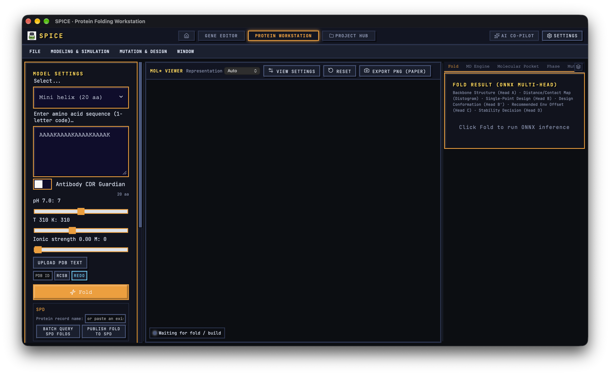
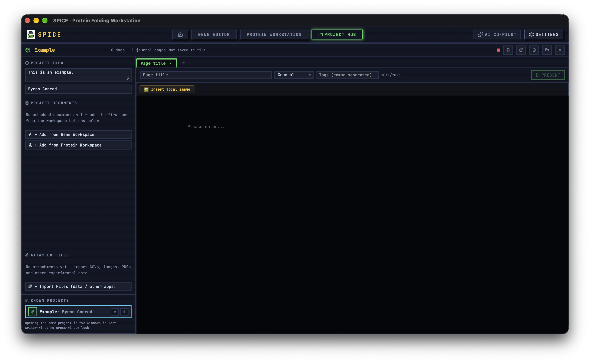

# SPICE GUI

**Gene editing, protein design, and project management — all in one place, all on your machine.**

SPICE (Sequence-Protein Interaction under Conditional Environments) GUI is a local-first desktop workbench: a **protein workbench** (multi-head fold inference, all-atom MD verification, stability scans), a **gene & cloning workbench** (plasmid maps, primers, assembly simulation), and a **project hub** that keeps every document, experimental record, and data file together in one container, with the electronic lab notebook built in and optional publishing to the public [SPD](https://d.spicebio.top) database. Computation runs where it should: fold inference via ONNX Runtime, MD verification via the [SPICE Engine](https://github.com/SPICE-Protein/spice_engine) Rust crate. No account and no upload are required and nothing leaves your desktop unless you publish.

Built with SvelteKit (Svelte 5), Tauri v2, Mol\*, and a pixel-art UI theme. Fully internationalized in seven languages.

## Screenshots

**Gene editor** — circular plasmid map, restriction enzymes, cut sites and sequence view in one screen.



**Protein workstation** — sequence + environment (pH / temperature / ionic strength) in, multi-head ONNX fold out, with the SPD publish panel below.



**Project hub** — journal pages, embedded workspace documents, attached experimental files, and one-click Presenter mode.



## Workspaces

### Protein workbench — `/protein`

> **Status** — the folding and corresponding-mutant workflows in this workbench are complete on the app side, but depend on the SPICE Model, which is still under development and training. Until the model ships, predictions are not publication-ready.

**Fold inference (ONNX multi-head)**

- One forward pass reads every trained head: reference Cα trace (Head A), per-position mutation probabilities (Head B, `[L,20]` softmax), design conformation coordinates (Head B′), recommended environment offset [ΔpH, ΔT] (Head C), and path-A/path-B stability confidence (Head D).
- Distogram head rendered as an expected-distance heatmap (48 bins, 3–48 Å) plus a Cα < 8 Å contact map.
- Trained-head status is surfaced honestly — the pretrain checkpoint reports which RL-stage heads are still random.
- Example library (mini helix / lysozyme / ubiquitin / GFP), free-form 1-letter sequence input, and pH / temperature / ionic strength sliders; sequence and environment persist across sessions.

**Structure import**

- Local PDB / mmCIF text files, RCSB fetch by 4-character ID, and PDB-REDO re-refined structures with R-free / Ramachandran Z-score deltas.
- Ligand-site annotation from the RCSB data API with crystallization-additive filtering, flagged against the active pocket.

**MD verification (SPICE Engine)**

- Build all-atom systems from imported structures (PDB or mmCIF) or Cα-seeded from the fold; optional NVT equilibration.
- Step batches of 1–100 steps with live potential-energy trace, simulated-ps clock, kinetic temperature vs target, ms/step, and coordinate-clamp counters.
- Bias-force injection toggle (random 16-dim action scaled by amplitude) to push the system out of local minima; ΔT hot-switch mid-run.
- Five biophysical metrics with thresholds — m1 potential fluctuation (MAD), m2 radius-of-gyration drift, m3 secondary-structure loss, m4 clash fraction, m5 surface charge mismatch — plus a pinnable biophysics-monitor HUD that floats over any tab.
- 2D conformational landscape (RMSD × Rg) with the MD trajectory drawn live as steps run.
- Solvent-reuse mutant rebuilds: localized L-BFGS relaxation on top of the parent solvation shell instead of a full rebuild.

**Stability & phase**

- Temperature × pH grid scans — one minimized template per pH, cloned across temperatures — streamed point by point to a heatmap (stable / crashed / build-failed) with progress and cancel.
- Cooperative-collapse tracker: a Landau expansion fitted over the scan points reports the metastable center, the ΔG = 0 boundary, the bifurcation limit, and a saddle-vs-well verdict.

**Mutation & screening**

- Top-8 substitutions per position from Head B with one-click apply; a combinatorial mutation cart with an epistasis compatibility heuristic for close pairs; mutant-vs-reference Cα overlay toggle; one-click application of the Head C environment offset.
- High-throughput screening: paste a CSV mutant library (`V15A`, multi-mutation tokens) and get real biophysical descriptors per variant — GRAVY, net charge at target pH, pI / ΔpI, helix propensity, disorder fraction, and a 0–100 thermostability score.

**Viewer & export**

- Mol\* headless viewer: Cα trace / cartoon / spacefill / ball-and-stick, background, camera, exposure, lighting, outline, bloom, SSAO presets; paper-ready PNG at 1/2/4× with a *Folded by SPICE* watermark.
- mmCIF export for fold and mutant structures — standard `entity` / `atom_site` blocks plus a custom `_spice` block carrying environment, method, and confidence.
- `.spicep` protein packages: sequence, environment, coordinates, simulation history, 2D landscape, and m1–m5 metrics in one file, round-trippable.
- Retro menu bar (FILE / MODELING & SIMULATION / MUTATION & DESIGN / WINDOW), six right-hand analysis tabs, three draggable columns, activity log, toasts and OS notifications.

### Gene & cloning workbench — `/gene`

**Maps & sequence editing** (derived from TeselaGen's Open Vector Editor — see Acknowledgments)

- Circular map with stacked feature arcs, primer track, cut-site ticks with leader-line labels, per-base letters at high zoom, rotate/pan/zoom, and drag-selection; linear map with strand-aware staggered arrows; click an enzyme label to linearize the plasmid at that cut site.
- Virtualized sequence viewer with minimap, Browse / Edit / Annotate modes, toggles for enzymes, features, primers and translations, modified-range diff highlighting, and an on-screen DNA keyboard for touch devices.
- Selection toolkit: GC, Tm, reverse-complement, delete, and a rich clipboard (text + JSON with overlapping features + rendered PNG); feature tooltips with CDS molecular weight; selection notes rendered as pseudo-features.
- Degenerate-IUPAC sequence search with reverse-strand hits; six color themes for the row renderer.
- Features tab with search / type filter / sorting and a full feature editor (13 built-in types plus custom types and colors); Properties tab with topology, host, accession links, and NCBI deep links; Notes tab with a Crepe WYSIWYG editor and DNA/protein block insertion.

**Enzymes**

- REBASE-synced enzyme catalog (NEB bionet format, GitHub fallback, local cache) with fuzzy search and 46-enzyme curated starter set.
- Methylation awareness: Dam / Dcm / EcoKI sites flagged as blocked on the maps.
- Nine cut-set presets (NEB Standard, Golden Gate, Rare Cutters, BioBrick, MoClo, blunt cutters…), custom named sets with JSON import/export, and per-enzyme NEB double-digest buffer activity (r1.1 / r2.1 / r3.1 / CutSmart %, preferred buffer, heat inactivation).

**Assembly & cloning**

- Cloning wizard with ten methods — restriction, Gibson, Golden Gate, In-Fusion, NEBuilder HiFi, Gateway, directional TOPO, TOPO, TA, GC — pre-flight validation, sticky-end junction schematics, and apply-to-workspace.
- Rust multi-fragment Golden Gate assembly (BsaI / BsmBI / BbsI parameterized overhang ordering) and Cre-loxP / FLP-FRT recombinase scenes (integrate / excise / invert).
- DNA end-modification panel: Klenow fill-in, T4 chew-back, phosphorylate, dephosphorylate.
- Expression cassette builder: promoter / RBS / CDS / terminator parts with orientation and topology checks.

**Primers & PCR**

- Auto primer pairs (SantaLucia nearest-neighbor Tm) plus a primer quality table: score, GC clamp, hairpin stem/loop Tm, self-dimers.
- 5′-end modification (clamp bases, 5′-phosphate), oligo annealing duplex view, and three PCR simulations — standard amplification, overlap-extension assembly, site-directed mutagenesis — each sendable to the virtual gel.
- Primer LIMS-lite: inventory with k-mer stock alignment against the open construct, order-sheet CSV export (Sangon / Tsingke / IDT formats), and 96-well plus 10×10 freezer grid maps.

**Analysis panels** (floating, draggable, from the ANALYSIS & VIEWS menu)

- Virtual gel: marker ladders (DL2000 → 1 kb Plus), agarose % / voltage / time migration physics, editable lanes, super-resolution PNG.
- Protein view cabin: properties (MW, pI, extinction, GRAVY, PTM motifs), structure (Chou-Fasman, FoldIndex, solubility, Tango hotspots, hydropathy), domain signatures, a codon-by-codon lifecycle scroller with ΔΔG readouts, and tryptic fingerprints / disulfides / epitope predictions.
- RNA folding (Nussinov with Rust window scan), GC sliding window, fusion reading-frame check, and ribosomal frameshifting (PRF) analysis with slippery-site presets.
- Advanced genomics: Salis translation-initiation RBS strength, σ70 promoter and TFBS motifs, signal peptide and TM helix detection, GC skew, CpG islands, tandem repeats.
- Evolution tools: local k-mer BLAST against the workspace and collections, native MAFFT multiple-sequence alignment (Rust) with consensus fallback, 2D dot-plots, and alignment-file import (Clustal / PHYLIP / NEXUS / STOCKHOLM…).
- NGS panel: FASTQ QC and adapter trimming (Rust), prokaryotic ORF/gene prediction with RBS scoring, CRISPR array finder.
- Synthetic-biology CAD: iGEM parts search and import (SynBioHub), SBOL2 export, BioBrick / MoClo compatibility validation, transformation-efficiency estimates, genetic-circuit gate detection, and CARD-AMR plus IGSC biosecurity screening against synced databases.
- Synthetic-gene QC: cryptic splice sites, Kozak strength, premature stops / NMD risk, codon-pair bias, DUST low-complexity masking — with one-click elimination where supported.
- Codon tools: optimizer with live CAI, Rust Codesign Pareto panel (CAI × ΔΔG multi-objective with Pareto scatter), reverse translation with host tables, and silent mutagenesis to add or remove restriction sites.
- CRISPR suite: SpCas9 / VQR / SaCas9 / Cas12a gRNA scanning with efficiency and specificity scoring, HDR donor design with PAM-disruption reports, pegRNA design for prime editing, and CBE/ABE base-editing windows.
- Reaction calculators: C1V2 dilutions, ligation mass ratios, PCR master mixes, ng/µL ↔ nM, gradient-PCR plans, gel band sizing, 4-parameter ELISA fits, Michaelis-Menten kinetics.

**Import, export & notebook**

- Drag-and-drop GenBank / EMBL / FASTA / FASTQ / SnapGene `.dna`; NCBI RefSeq (18 organisms), Ensembl, UniProt; GFF3 / GTF / BED annotation overlays; sequence collections with ZIP round-trip (Rust).
- Auto-annotation: UniVec_Core contaminant screening (k-mer) plus a Rust Smith–Waterman feature aligner, idempotent re-runs.
- Sanger traces: `.ab1` / `.scf` import with chromatogram viewer (four-dye curves, Phred bars, paging) and auto-validation against the reference construct.
- `.spiceg` documents with dirty tracking, optional autosave, crash-recovery restore, and GenBank / FASTA / EMBL export; 100-step undo/redo with a snapshot browser.
- ELN: multi-page notebook with categories and tags; pages are signed with the verified ORCID identity into a SHA-256 digest, audit trail, locked state, and a 21 CFR Part 11-style markdown report.

### Project hub — `/project`

- One `.spiceproj` file holds everything: gene and protein documents are **embedded in full** (not referenced), alongside a multi-page Markdown journal with categories and tags.
- On disk this is the SPJB private binary container — roughly 4× smaller than gzip-JSON, with byte-identical restore of float32 payloads; older plain-JSON generations still import.
- Attached files (CSVs, images, PDFs, anything ≤ 20 MiB) live inside the project with in-app previews and save-as.
- Capture-and-carry handoff: workspaces snapshot into the project or open embedded docs with a live write-back banner; project registry and session resume survive restarts; dirty LED and Ctrl+S throughout.
- **Presenter mode** — split any journal page into slides by headings and `---` rules; quote blocks become speaker notes. Full grammar: task lists, tables with alignment, footnotes, highlights, sub/superscripts, presenter-only comments. Audience and presenter views, next-slide preview, elapsed timer, keyboard navigation, fullscreen.

### SPD integration

- **Universal API Token** — mint one at [d.spicebio.top](https://d.spicebio.top) after ORCID login, paste it into *Settings → Public Integrations*, verify. The token inherits your live roles and revokes instantly.
- **Publish chain** — `(protein | construct | variant) → sequence → fold`. A fold embeds its MD simulation environment and model identity (the checkpoint is hashed locally); every entity deduplicates server-side, so republishing is idempotent. Folding coordinates themselves stay local — only summary records go to the database.
- **Batch lookup** — the graph-DSL read endpoint (`POST /query`) walks `sequence → folds → environment` for every locally known sequence id in one metered request, matching your current simulation environment exactly.
- Publishing is desktop-only: the API's CORS policy excludes packaged apps, so requests go through the Rust bridge, and the checkpoint SHA-256 can only be computed locally.

### Global experience

- **Settings**: seven interface languages, ten color palettes with dark/light/system modes, ORCID identity with auto-revalidation, model status / path / cloud download with progress, database syncs (REBASE, CARD-AMR, IGSC biosecurity), engine defaults, primer salt parameters, and a rebindable keyboard-shortcut editor with conflict detection (~21 bindings).
- **AI Co-Pilot**: chat against any OpenAI-compatible endpoint (local Ollama by default) with workspace context injected — sequence, environment, metrics; replies carrying ` ```json ` mutation arrays or ` ```dna ` blocks import straight into the editors. The bundled calculators (mutation stabilizer, codon optimizer, SOP drafts) are clearly-labeled local heuristics, not engine calls, and offline mode says so.
- Pixel-retro chrome throughout: hover-dropdown menu bars, draggable floating panels with z-order focus, activity logs, in-app toasts plus native OS notifications, and a portrait-orientation guard on phones/tablets.

## Architecture

```
┌──────────────────────────────────────────────────────┐
│ SvelteKit (Svelte 5 runes) + svelte-multistyle-ui    │
│ routes: welcome · /protein · /gene · /project ·      │
│         /settings                                    │
│ lib: backend (invoke wrappers + browser demo mode)   │
│      gene/ cloning components · project/ SPICE_      │
│      PROJECT · spd/ client · viewer/ Mol* ·          │
│      identity/ ORCID · i18n Paraglide                │
└───────────────────────┬──────────────────────────────┘
                        │ Tauri IPC (invoke)
┌───────────────────────▼──────────────────────────────┐
│ src-tauri (Rust)                                     │
│  onnx.rs     ort inference · tokenize · post-process │
│  spice.rs    SPICE Engine build/step/scan/metrics    │
│  spd.rs      HTTP bridge (no CORS) · checkpoint hash │
│  cloning.rs  Smith–Waterman annotator · UniVec sync  │
│  files.rs    native save dialogs                     │
└──────────────────────────────────────────────────────┘
```

`pnpm dev` runs the frontend in a plain browser: every Tauri command degrades to a typed local fallback so the entire UI stays navigable and testable without Rust, a model, or the engine.

## Getting started

Prerequisites: Node 22, pnpm, a stable Rust toolchain, and [Tauri v2 system dependencies](https://v2.tauri.app/start/prerequisites/).

```bash
pnpm install

pnpm dev          # browser preview (demo mode) → http://localhost:1420
pnpm tauri dev    # desktop app — the first Rust compile is slow (engine + candle + ONNX Runtime)
pnpm tauri build  # bundles for the host platform
```

**Model**: place an SPICE ONNX checkpoint on disk and point *Settings → Model* at it; the model itself is still under development and training (see the Protein workbench status note) and ships separately from this repo. Without a model the desktop app tells you so — it never fabricates predictions.

**Engine**: `src-tauri/Cargo.toml` depends on `spice_engine` from GitHub. Two `[patch.crates-io]` entries (the `ewald` and `bio_files` forks under SPICE-Protein) are mandatory in this root manifest — Cargo does not propagate patches declared by dependencies. The engine's default features pull in candle (GNN inference) and the heavy force-field assets; expect a sizeable binary.

## Quality gates

```bash
pnpm check                    # svelte-kit sync + svelte-check (0 errors required)
pnpm build                    # static frontend build
pnpm i18n                     # recompile Paraglide catalogs after editing messages/*.json
cd src-tauri && cargo check   # Rust backend
```

All visible strings go through Paraglide (`project.inlang/messages/{zh,en,ja,ko,de,nl,sv}.json`, with Chinese as the source catalog); Rust emits `i18n:key::args` codes that the frontend resolves. Hardcoded UI strings fail review.

## Repository layout

```
src/routes/           five workspaces (welcome, protein, gene, project, settings)
src/lib/backend/      typed invoke wrappers, browser fallbacks, mmCIF export, demo mode
src/lib/gene/         cloning UI components (maps, primers, gels, CRISPR, QC)
src/lib/project/      SPICE_PROJECT store, .spiceproj container, Presenter mode
src/lib/spd/          SPD client (transport switch, publish chain, graph DSL)
src/lib/viewer/       Mol* wrapper and view settings
src/lib/identity/     ORCID profile and ELN signing identity
src/lib/paraglide/    compiled i18n catalogs (generated — edit project.inlang instead)
project.inlang/       message source and plugin config
scripts/              logo sync, Android landscape patch, UniVec fetch
src-tauri/            Rust backend (see architecture), Tauri config, capabilities
.github/workflows/    multi-platform CI with optional signing
```

## Acknowledgments

Special thanks to [TeselaGen Open Vector Editor](https://github.com/TeselaGen/openVectorEditor) (MIT) for providing such an excellent DNA editor — the gene/cloning workbench in this app is a derivative work, developed on top of OVE and integrated into the GUI.

## License

Apache-2.0 — see [LICENSE](LICENSE).
